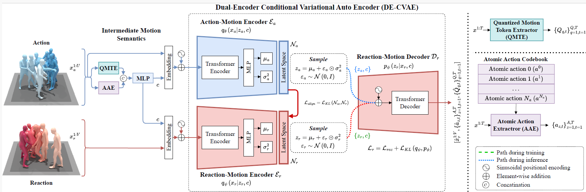

# From Action to Reaction: LatentSpace Regularization and Alignment for Human Reaction Motion Generation with Intermediate Motion Semantics


The official PyTorch implementation of the paper [**"From Action to Reaction: LatentSpace Regularization and Alignment for Human Reaction Motion Generation with Intermediate Motion Semantics"**](https://alimanjotho.github.io/ls-re-mgm/).

Please visit our [**webpage**](https://alimanjotho.github.io/ls-re-mgm/) for more details.




## Getting started

This code was tested on `Windows11 24H2` and requires:

* Python 3.7.13
* PyTorch 1.7.1
* conda3 or miniconda3

### 1. Setup FFMPEG
* Download ffmpeg from https://www.ffmpeg.org/download.html#build-windows
* Extract it in `C:\ffmpeg`.
* Add `C:\ffmpeg\bin` in `PATH` environment variable.


### 2. Setup miniconda environment
```shell
conda env create -f environment.yml
conda activate lsremgm
python -m spacy download en_core_web_sm
pip install git+https://github.com/openai/CLIP.git
```

* Download dependencies:

```bash
bash protos/smpl_files.sh
bash protos/glove.sh
bash protos/t2m_evaluators.sh
```


### 3. Get datasets

**HumanML3D**
* Follow the instructions in [HumanML3D](https://github.com/EricGuo5513/HumanML3D.git), then copy the resultant dataset to this repository:

```shell
cp -r ../HumanML3D/HumanML3D llm-fqk-t2m/dataset/HumanML3D
```

**KIT**
* Download from [HumanML3D](https://github.com/EricGuo5513/HumanML3D.git) and the place result in `./dataset/KIT-ML`


### 4. Get the pretrained models

* Download the pretrained models and place then unzip and place them in `./checkpoints/`. 

* **HumanML3D** ([lsremgm_humanml3d](https://drive.google.com/file/d/1JrVp4zO-gOYJAadhF1i_JemJje7Wzuw6/view?usp=sharing))
* **KIT** ([lsremgm_kitml](https://drive.google.com/file/d/1SHCRcE0es31vkJMLGf9dyLe7YsWj7pNL/view?usp=sharing))


## Motion Generation

### Generate from a single prompt

```shell
python -m sample_lsremgm.sample --model_path ./checkpoints/lsremgm_humanml3d_000294000/lsremgm_humanml3d_000294000.pt --text_prompt "a person is jumping on floor" --cuda True --motion_length 9
```

### Generate from test set prompts

```shell
python -m sample_lsremgm.sample --model_path ./checkpoints/lsremgm_humanml3d_000294000/lsremgm_humanml3d_000294000.pt --num_samples 10 --num_repetitions 3
```

### Generate from text file

```shell
python -m sample_lsremgm.sample --model_path ./checkpoints/lsremgm_humanml3d_000294000/lsremgm_humanml3d_000294000.pt --input_text ./assets/sample_prompts.txt
```


**You may also define:**
* `--device` id.
* `--seed` to sample different prompts.
* `--motion_length` in seconds (maximum is 9.8[sec]).

**Running those will get you:**

* `motions.npy` file with text prompts and xyz positions of the generated animation
* `prompt##_rep##.mp4` - a stick figure animation for each generated motion.


### Rendering SMPL meshes  in Blender

* Download and install blender https://www.blender.org/download/.
* `{VER}` = your blender version, replace it accordingly.
* Blender>Preferences>Interface> Check Developer Options
* Add the following paths to PATH environment variable.
```shell
C:\Program Files\Blender Foundation\Blender {VER}
C:\Program Files\Blender Foundation\Blender {VER}\{VER}\python\bin
```
* Run CMD as Administrator and follow these commands:
```shell
"C:\Program Files\Blender Foundation\Blender {VER}\{VER}\python\bin\python.exe" -m ensurepip --upgrade
"C:\Program Files\Blender Foundation\Blender {VER}\{VER}\python\bin\python.exe" -m pip install matplotlib --target="C:\Program Files\Blender Foundation\Blender {VER}\{VER}\scripts\modules"
"C:\Program Files\Blender Foundation\Blender {VER}\{VER}\python\bin\python.exe" -m pip install hydra-core --target="C:\Program Files\Blender Foundation\Blender {VER}\{VER}\scripts\modules"
"C:\Program Files\Blender Foundation\Blender {VER}\{VER}\python\bin\python.exe" -m pip install hydra_colorlog --target="C:\Program Files\Blender Foundation\Blender {VER}\{VER}\scripts\modules"
"C:\Program Files\Blender Foundation\Blender {VER}\{VER}\python\bin\python.exe" -m pip install shortuuid --target="C:\Program Files\Blender Foundation\Blender {VER}\{VER}\scripts\modules"
"C:\Program Files\Blender Foundation\Blender {VER}\{VER}\python\bin\python.exe" -m pip install omegaconf --target="C:\Program Files\Blender Foundation\Blender {VER}\{VER}\scripts\modules"
"C:\Program Files\Blender Foundation\Blender {VER}\{VER}\python\bin\python.exe" -m pip install moviepy==1.0.3 --upgrade  --target="C:\Program Files\Blender Foundation\Blender {VER}\{VER}\scripts\modules"
```

* Download Blender Animation Files:
https://drive.google.com/file/d/1EbUkwPCt7eB9HAZXtM-nCxsztkfsRImD/view?usp=sharing

* To create SMPL mesh per frame run:

```shell
python -m visualize.render_mesh --input_path /path/to/mp4/stick/figure/file
```

**This script outputs:**
* `prompt##_rep##_smpl_params.npy` - SMPL parameters (thetas, root translations, vertices and faces)
* `prompt##_rep##_obj` - Mesh per frame in `.obj` format.


## Train LS-ReMGM

**HumanML3D**
```shell
python -m train.train_lsremgm --save_dir checkpoints/lsremgm_humanml3d_1 --dataset humanml
```

**KIT**
```shell
python -m train.train_lsremgm --save_dir checkpoints/lsremgm_kitml_1 --dataset kit
```


* Use `--diffusion_steps 200` to train the faster model with less diffusion steps.
* Use `--device` to define GPU id.
* Add `--eval_during_training` to run a short (90 minutes) evaluation for each saved checkpoint. 
  This will slow down training but will give you better monitoring.

## Evaluation

* Single GPU

**HumanML3D**
```shell
python -m evaluations.eval_humanml --model_path ./checkpoints/lsremgm_humanml3d_000294000/lsremgm_humanml3d_000294000.pt
```

**KIT**
```shell
python -m evaluations.eval_humanml --model_path ./checkpoints/lsremgm_kitml_000294000/lsremgm_kitml_000294000.pt
```


## Bibtex
```
@article{
manjotho2025lsremgm,
title={From Action to Reaction: LatentSpace Regularization and Alignment for Human Reaction Motion Generation with Intermediate Motion Semantics},
author={Ali Asghar Manjotho and Tekie Tsegay Tewolde and Ramadhani Ally Duma and Zhendong Niu},
journal={IEEE Transactions on Multiledia},
year={2025}
}
```


## Acknowledgments

This code is standing on the shoulders of giants. We want to thank the following contributors
that our code is based on:

[guided-diffusion](https://github.com/openai/guided-diffusion), [MotionCLIP](https://github.com/GuyTevet/MotionCLIP), [text-to-motion](https://github.com/EricGuo5513/text-to-motion), [actor](https://github.com/Mathux/ACTOR), [joints2smpl](https://github.com/wangsen1312/joints2smpl), [MoDi](https://github.com/sigal-raab/MoDi).

## License
This code is distributed under an [MIT LICENSE](LICENSE).

Note that our code depends on other libraries, including CLIP, SMPL, SMPL-X, PyTorch3D, and uses datasets that each have their own respective licenses that must also be followed.
